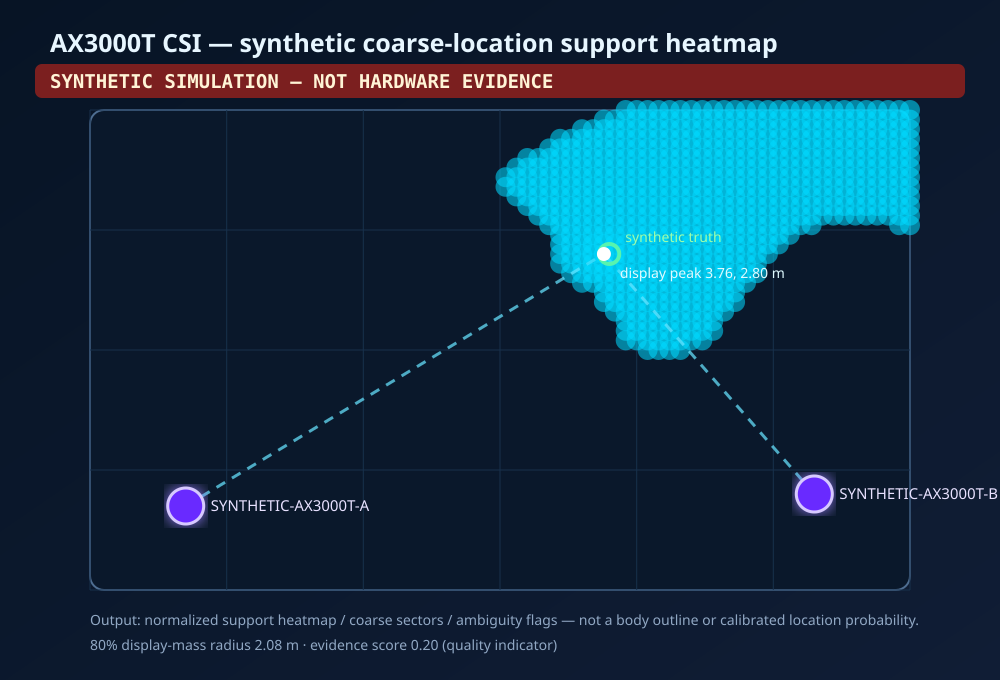
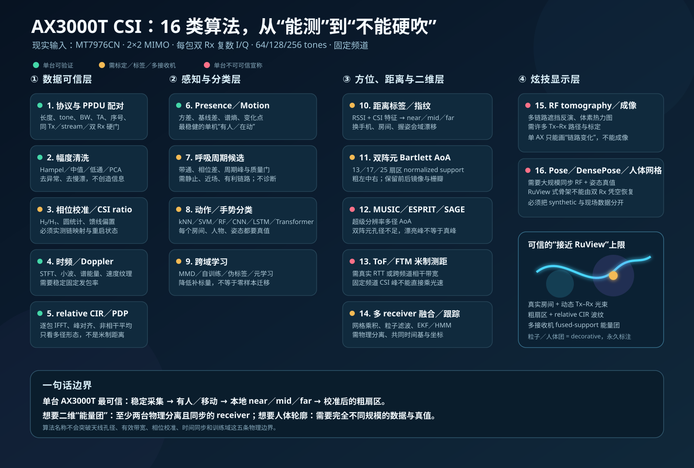

# AX3000T CSI Stage 3：可审计的粗方位与距离代理

这是一条离线、证据优先的实验链：CSI2 录制 → 同 PPDU/同 Tx/stream
双 Rx 配对 → 有向天线基线与链间复比值校准 → 双阵元 Bartlett 粗角度支持
→ 本房间标注的近/中/远代理 → 多接收机二维支持热力图。

它刻意不输出“厘米坐标”“CSI 绝对 ToF”“人体轮廓”或伪装成统计概率的
softmax。`evidence.score` 只是输入与模型质量指标，不是结果正确率。

## 输出与正确解读

| 输出 | API/JSON 名称 | 能说明什么 | 不能说明什么 |
|---|---|---|---|
| 同包配对 | `GroupedPPDU` + flags | 两个 Rx 是否很可能来自同一 PPDU、同一 Tx/transport stream | 主机时间接近不等于硬件同步 |
| 粗角度 | `normalized_support`、13+ sectors | 哪些角度/扇区更受两阵元相位支持 | 不是校准过的角度概率；有前后镜像和栅瓣 |
| 距离代理 | `support_weights` | 本房间、本设备标签中的 near/mid/far 支持 | 不是米制测距或 likelihood |
| relative CIR | 相对峰、RMS delay spread | 多径形态与相对变化 | 峰位置不能乘光速当距离 |
| 二维展示 | `fused_normalized_support`、80% display-mass radius | 多个真实分离接收机的交汇支持区域 | 不是 Bayesian posterior 或可信区间 |

## 真实 CSI 的硬契约

解码成功并不代表可做相位/CIR。真实分析只接受 Stage 2 CSI2 v2 且同时满足：

- quality byte 不含 `TRUNCATED`；
- CSI2 reserved byte、未知 quality bit、未知 presence bit 一律拒绝；
- `CH_BW_INFERRED` 或 `DATA_NUM_INFERRED` 不能进入相位/时延分析；
- 包含 `TONE_MASKED_REORDERED`，即 Stage 2 已启用并审计 type-5
  mask+reorder；未知 tone order 一律拒绝；
- `channel BW` 与 `data BW` 是 MediaTek 原始枚举 `0/1/2`，分别对应
  20/40/80 MHz；当前保守要求两者相等；
- 样本数严格为 64/128/256；频率和 band presence bit 必须存在；
- `FREQ_IS_PRIMARY` 只允许 20 MHz；40/80 MHz 缺中心频率时拒绝，因为
  尚未验证 `pri_idx`/子信道到 tone 坐标的映射；
- segment/remain presence 必须存在且 `remain_last=0`。Stage 2 已完成
  80 MHz 重组，最终 `segment_num` 仅是 provenance，Stage 3 **绝不二次拼接**；
- `rx_mode` presence/value 必须存在，只接受当前 Stage 2 type-5 switch 明确
  处理的 OFDM/HT/VHT/HE-SU 枚举，并把 mode、tone profile 与 CSI-grid spacing
  一起写进 radio signature；未知 mode 或 capture 中途换 mode 立即拒绝；
- 第一轮真实实验优先固定 20 MHz，验证链映射、符号、相位状态和重启稳定性，
  再分别审计 40/80 MHz。

CSI2 连续录制使用 `u32 big-endian length + datagram`，绝不靠扫描 magic 猜
边界。协议字段与 Stage 2 `docs/UDP_V2.md` 对齐。

## 同 PPDU 与多流规则

强身份是 `TA + band + pkt_sn + driver_ts`。相同身份按有界 host-time epoch
分代，以免长录制中的 packet/timestamp 回绕碰撞。记录不会只按 `rx_idx`
折叠，而是保留完整键：

```text
(tx_idx, rx_idx, transport_stream)
```

AoA 只能在**同一个 Tx 和 transport stream**中比较两个 Rx。映射未指定
selector 且存在多个候选时拒绝；完全等价重复可去重，冲突重复、不同 tone
长度、频率/BW/segment/quality 冲突均为硬失败。

`--allow-low-confidence` 只允许缺失强 PPDU 身份时使用保守 fallback；它不能
绕过截断、tone order、长度、segment 或元数据硬门。

## 录制与 session manifest

录制器发送 Stage 2 的 `register-v2`，默认端口与 Stage 4 约定统一为 8888。
它要求精确 allowlist：路由器 UDP **源 IP:源端口**与一个 TA。示例：

```bash
ax3000t-localize record capture.csi2f session.json \
  --router-host 192.0.2.1 --router-port 8888 \
  --listen-port 8888 --allow-sender 192.0.2.1:8888 \
  --allow-ta 02:11:22:33:44:55 \
  --session-id room-a-20260831-01 --receiver-id ax3000t-a \
  --interface phy1-ap0 --boot-id BOOT_ID --radio-epoch RADIO_EPOCH \
  --timebase-id PTP_DOMAIN --clock-uncertainty-ns 100000 \
  --driver-commit DRIVER_COMMIT --source-tree-hash 64_HEX_SHA256
```

`192.0.2.1` is an RFC 5737 documentation-only address. Replace it in both
arguments with the router's actual management IP; do not copy the example
address into a live capture configuration.

manifest 封存：router/interface、boot/radio epoch、driver commit/source hash、
频道/BW/tone mode、共享 timebase 与最大时钟不确定度、时间窗、sender/TA、
sequence loss/duplicate/out-of-order、capture SHA-256。加载时会逐帧重解码、
验证计数/首尾序号/单 TA/单 radio config 与 hash；任意字符串 JSON 不能冒充
provenance。真实 AoA、CIR、校准与 bound-range API 还要求所用记录是这份已验证
capture 的精确子集；同一 fd 完成读取、SHA 与解帧，避免 hash 后换绑另一文件。
capture 与 manifest 使用不同的独占 `.partial` 文件；所有路径组件
通过 no-symlink directory fd 绑定，拒绝不安全的可写祖先目录；`fsync` 后以
hard-link no-clobber 封存、强制 `0600`，并在成功前重新核对公开路径仍指向同一
inode 与 hash。失败或竞争写入不会覆盖/删除别人的目标。

manifest/calibration/model 的 `sha256:` ID 是**内容完整性 ID，不是签名或远程
证明**。`boot_id`、`radio_epoch`、timebase、天线坐标、房间 ID 与设备标签仍是
操作者声明；真实报告必须另附如何测得这些值的证据。

真实 capture、session、room 与 calibration 默认被 `.gitignore` 排除；见
[`PRIVACY.md`](PRIVACY.md)。

## 天线映射与校准

[`examples/chain_mapping.example.json`](../examples/chain_mapping.example.json) 只是
模板。必须实测 `rx_idx → RF 链 → 天线相位中心`，用米制 `(x,y)` 写入坐标，
并记录 Tx/transport-stream selector。角度约定：x 向右/东、y 向上/北，bearing
逆时针增加；局部 angle 相对 `array_broadside_heading_deg`。

steering phase 使用有向向量 `position(target Rx) - position(reference Rx)` 与
入射方向的点积，不再丢失左右符号。基线至少 20 mm（仅是拒绝明显伪几何的
保守门，不代表已测得原装天线间距），并在 15° 内垂直于所填 broadside。
校准必须使用两个不同 capture：一个拟合点和一个不参与拟合的
opposite-side holdout。两点都须 `10° ≤ |angle| ≤ 75°`、符号相反且至少相隔
20°；每个 capture 独立通过 packet/concentration 门，随后比较两者推回的
硬件相位，median/P90 residual 超限即拒绝。相同 CSI samples 即使改写 session、
hash、时间戳或序号也不算独立；0° broadside、重复 capture、反转链方向或明显
静态多径不一致都不能被“校准”吞掉。

```bash
ax3000t-localize calibrate \
  calibration-left.csi2f calibration-left-session.json \
  validation-right.csi2f validation-right-session.json \
  examples/chain_mapping.example.json calibration.json \
  --known-angle 25 --validation-angle -25 --minimum-packets 30

ax3000t-localize aoa target.csi2f target-session.json calibration.json \
  --sectors 17 --minimum-packets 12 --output target-aoa.json
```

校准工件 ID 绑定 schema、映射、两份 session provenance、两个带符号角度、
holdout residual、每 tone 复比值和 concentration；篡改后无法加载。目标
capture 必须匹配 receiver、boot、radio epoch、driver/source hash 和完整
radio/tone profile。重启、换频道、换驱动、移动天线或馈线后必须重校。

两点通过仍不证明房间里不存在方向相关静态多径；它只是比单点校准更强的
fail-closed 门。正式实验还应增加多个不参与拟合的角度/距离/重启 holdout。

## CIR 与多接收机融合

```bash
ax3000t-localize cir target.csi2f target-session.json \
  --rx-idx 0 --tx-idx 0 --transport-stream 0 --include-profile
```

CIR CLI 与 AoA 共用相同硬契约和 packet/tone 样本量门。每包先单独 IFFT、按
最强峰对齐，再对归一化 power 做 non-coherent average；不会因不同包的公共
相位相消后偷偷改用 `mean(abs(CSI))`。输出仍只有相对 delay morphology。

near/mid/far 模型内容 hash 同时绑定训练 feature/label、room/device 与
`training_source_ids`。要进入二维融合，预测还必须由
`extract_bound_range_features()` 绑定实际 capture manifest、receiver、TA、
radio profile 与真实取样时间窗；裸 feature vector 只可离线评估，并带
`not_capture_bound`，不能给当前 AoA 热力图加权。训练 source ID 和 room 标签
仍是操作者声明，不是训练真值的密码学认证。

二维融合需要两个或更多物理分离 receiver。每条 observation 必须有唯一
receiver/calibration/capture-manifest artifact ID、相同 TA、兼容 radio/tone
config、实际使用数据的重叠时间窗、相同显式 timebase，且时钟不确定度不超过
门限。共享区间会从两端扣除各自 uncertainty，默认至少剩 1 ms。未同步路由器即使 wall-clock
数值重叠也拒绝；同坐标/过近的“虚拟 AP”、重复 ID、零证据均拒绝，低证据
接收机被忽略而不是偷偷设置 `0.1` 权重下限。

这里的 receiver 坐标/heading/room ID、`timebase-id` 与
`clock-uncertainty-ns` 是采集者写入 manifest 或调用参数的
provenance 声明，不是软件自行测得或加密证明的同步。Stage 3 只能核对多份声明
是否一致并执行阈值/重叠门；真实实验仍必须用 PTP、共同触发或独立时钟测量来
产生并保存该证据，不能靠填写相同字符串制造“同步”。

## 合成演示

```bash
ax3000t-localize demo --output-dir synthetic-demo --sectors 17
```

输出包含两个 receiver 的独立校准/session、kNN、结果 JSON 与 SVG。所有产物
醒目标注 **SYNTHETIC SIMULATION — NOT HARDWARE EVIDENCE**，只证明软件路径可
复现，不证明 AX3000T 精度。

公开源码包是精确 allowlist，不使用递归 glob。发布前运行：

```bash
python -m build
python tools/verify_stage3_sdist.py dist/ax3000t_csi_localization-0.1.0.tar.gz
shasum -a 256 -c STAGE3_DELIVERY_MANIFEST.sha256
```

真实 capture、私钥或任意未列出的 synthetic-demo/tests fixture 文件都不得进入
sdist；检查器逐字节核对公开源文件与固定生成 metadata，并拒绝路径穿越、
symlink/hardlink、重复成员、额外空目录、未归一化 owner 和任意 PAX 字段。



## 模块

| 模块 | 职责 |
|---|---|
| `csi2.py` / `contracts.py` | CSI2 解码与不可绕过的真实分析契约 |
| `session.py` / `recorder.py` | allowlist 录制、丢包统计、hash 与 provenance |
| `grouping.py` | 同 PPDU epoch、完整 stream key、重复/冲突门 |
| `calibration.py` | 有向阵列几何、链间复比值圆统计、内容 hash ID |
| `aoa.py` | 两阵元 Bartlett、13+ normalized-support sectors、栅瓣候选 |
| `range_proxy.py` | 近/中/远 labeled kNN support 与设备/房间域漂移 |
| `cir.py` | relative CIR/delay-spread diagnostics |
| `fusion.py` | 多 receiver 2D fused support 与时间/几何一致性门 |
| `simulate.py` / `visualization.py` | 确定性合成验证和明确标识的 SVG |

物理边界见 [`BOUNDARIES.md`](BOUNDARIES.md)，研究证据见
[`SOURCES.md`](SOURCES.md)。

## 16 类算法地图

下面这张图把“能在单台 AX3000T 上验证”“需要额外标定、标签或 receiver”与
“单台设备不可可信宣称”分开。它按算法族计数，不把同一族里的 CNN/LSTM 或
MUSIC/ESPRIT 各自重复凑数。


